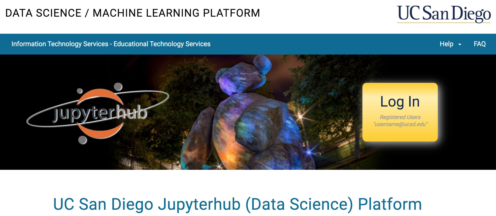
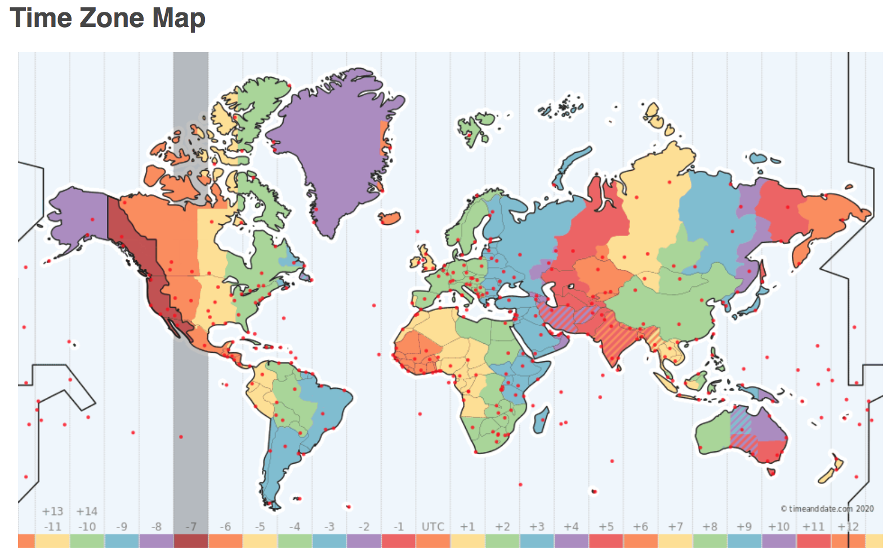
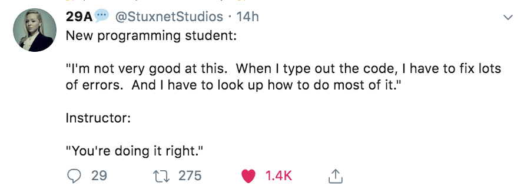

<div class="alert alert-danger">
  <strong>Reminder:</strong> All lectures for COGS 18 are being recorded.
</div>

# Introduction to Python

Shannon Ellis

**Important Note**: This course was originally designed and developed by [Tom Donoghue](https://tomdonoghue.github.io/). While lectures, assignments, exams and coding labs will be altered from the original run of the course in Fall 2018, *tons* of credit for this course is due to Tom for his awesome work getting this course off the ground.


The PDF slides from the start of the first class are available here: https://cogs18.github.io/assets/intro/01_welcome.pdf

# Logistics

- Who:
    - Instructor: Shannon Ellis 
    - TAs: Paul & Sylvia
    - "IAs": Jose & Taylor
    
- Where:
    - Lectures M-Th @ 11AM - 12:20PM (remote)
    - Coding Lab Sections (Mon & Wed; 1 or 2 PM)
    - Course Website: https://cogs18.github.io
    - Piazza Page: https://piazza.com/ucsd/summer2020/cogs18

# Expectations & Approach

- Goal: to learn practical programming in Python
- How: hands-on, community driven, skills based course, assignment & project driven
- Lectures & Lab Sections will be used for interactive activities
- Assignments, coding labs & a final project will be designed to get you coding

## Why Learn Computation?

- Computation is how things are done

- Computation is the foundation of much of the modern world

## What is Python


- Python is a programming language
    - It is a way to do computation
    - It gets the computer to do the work for you

- Python is an ecosystem
    - It is a culture of practice for computation

## What does Python look like


{:.input_area}
```python
variable_name = "variable name."
print(variable_name)
```


{:.output_stream}
```
variable name.

```


{:.input_area}
```python
a = 1
b = 2

c = a + b

print(c)
```


{:.output_stream}
```
3

```

## Why Choose Python?

- Python is a powerful, well developed, and well supported tool

- Python is general purpose, with an immense, multi-purpose ecosystem

- Python is human focused, with a strong user & developer community 

- Python is open-source and accessible

## This is a Jupyter Notebook

Uses in COGS18:

- lecture notes
- assignments
- coding labs

#### Clicker Question #1

**How excited are you for COGS 18?**

A. Super excited!  
B. The most excited!  
C. Couldn't be more excited!  
D. I love 8AM classes!  

## Tools

This notebook will guide through the tools you will need for class materials and assignments, and how to get them. 

### Prerequisites

This course and associated materials do not presume any prior knowledge of Python, or programming in general. 

To work with the course materials, you will need make sure you have access to the tools tools described here on datahub. 

It will be helpful for the final project if they are also installed on the computer you will be using. 

None of the materials are computationally heavy. 

### What do you need?

- Access to datahub
- Python: Working install of python 3.6 or 3.7 (suggested)
    - We will be using the Anaconda distribution
- Jupyter Notebooks (suggested)


<center></center>

<div class="alert alert-success">
Python is a programming language, whose development is led by the Python Software Foundation (PSF). 
</div>

<div class="alert alert-info">
The official Python organization website is available <a href="https://www.python.org" class="alert-link">here</a>.
</div>

## Python

- Versions: there are different versions of Python.
    - We will be using 3.6 and/or 3.7
- Packages: Python includes a "base set" of code (the standard library), and an extensive ecosystem of third party packages
    - In this course, we will largely focus on the standard library
    - For access to other packages when we need them, we will use Anaconda

<center></center>

<div class="alert alert-success">
Anaconda is an open-source distribution of Python, focused on scientific computing in Python. 
</div>

<div class="alert alert-info">
The anaconda website is 
<a href="https://www.anaconda.com" class="alert-link">here</a>. 
</div>

<center></center>

<div class="alert alert-success">
Conda is a package management tool, that comes with anaconda. 
</div>

<div class="alert alert-info">
Conda documentation is available
<a href="https://conda.io/docs/" class="alert-link">here</a>.
</div>

## The Anaconda Ecosystem

- Anaconda itself is a distribution - that is, a copy of the Python standard library, included a curated collection of external packages.
- Conda is a package manager, allowing you to download, install, and manage other packages. 

<center></center>

<div class="alert alert-success">
Jupyter notebooks are a way to intermix code, outputs and plain text. 
They run in a web browser, and connect to a kernel to be able to execute code. 
</div>

<div class="alert alert-info">
The official Jupyter website is available 
<a href="http://jupyter.org" class="alert-link">here</a>.
</div>

### Installation

You only need access to datahub for this course, but for working on your projects and for downloading and opening the notebooks used in class, you may want to download anaconda onto your computer, which comes complete with conda, and Jupyter notebooks.

<div class="alert alert-info">
Download anaconda from
<a href="https://www.anaconda.com/download/" class="alert-link">here</a>.
</div>

### Notes

- If you are on Mac, you have a native installation of Python. This native installation of Python may be older, will not include the extra packages that you will need for this class, and is best left untouched. 
    - Downloading anaconda will install a separate, independent install of Python, leaving your native install untouched. 
- Windows does not require Python natively and so it is not typically pre-installed. 


{:.input_area}
```python
# You can check which python you are using, and what version it is.
#  Once you have installed anaconda, you should see you are using Python in your anaconda folder
#  Make sure that the version you have is 3.6 (or at least 3.X)
#  Note: these are command-line functions that may not work on windows
!which python
!python --version
```


## JupyterHub

<div class="alert alert-success">
JupyterHub allows Jupyter notebooks to be shared across multiple users.
</div>

<div class="alert alert-info">
The official JupyterHub website is available 
<a href="https://jupyterhub.readthedocs.io/en/stable/" class="alert-link">here</a>.
</div>


### Datahub

UCSD hosts its version of JupyterHub and calls it datahub. This is what you'll be using in class.

It is available here: http://datahub.ucsd.edu

<center></center>

### When to use Datahub?

- Course Lecture Slides (opt.)
- CodingLabs
- Assignments


#### Lecture Slides:

Once you've logged into datahub, paste the following in your browser:

https://datahub.ucsd.edu/hub/user-redirect/git-sync?repo=https://github.com/COGS18/LectureNotes-Su20

#### CodingLabs & Assignments:
- Fetch & complete on datahub
- do not change file names
- do not copy cells provided
- adding cells *is* allowed!
- `print()` statements encouraged

- For Submission:
    - Before you click submit, make sure it's the thing you want to submit
    - You ***must click submit***.

    - Always check that the CodingLab/Assignment shows up under "submitted assingments"
    - You can submit as many times as you want
    - We only have access to your most recent submission
    - If you submit past the deadline, we will only have access to your late submission

### A note about: Timezones

- Due Dates are in UTC
- All deadlines are 11:59 PM PDT



TimeZones: https://www.timeanddate.com/time/map/


<center></center>

