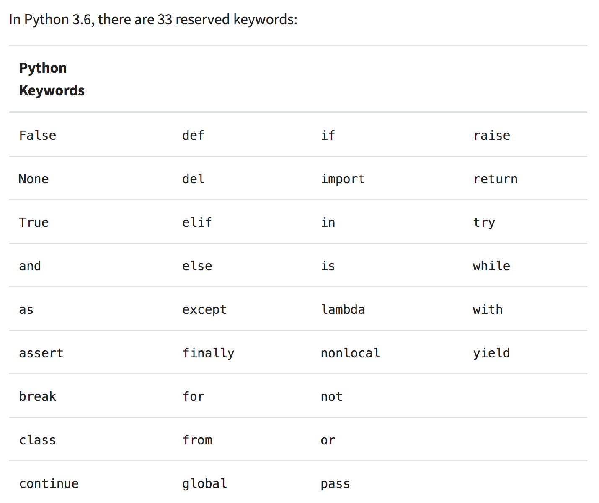

# Variables

- namespace
- variable types
- aliases
- whitespace

### Reminders

- In programming `=` means assignment
- There can be more than one assignment in a single line
- Anything to the right of the `=` is evaluated before assignment
    - This process proceeds from right to left

### Clicker #1

To warm our brains up and get us thinking about variable assignment again, **What would be the value of `b` after running the following code cell?**


{:.input_area}
```python
a = 16
b = 'string'
c = a + 16
b = 72
my_variable = b + a
my_variable
print(b)
```


- A) 'string'
- B) 88
- C) 72
- D) This code will fail

### Clicker #2

After executing the following code, what will be the value of `var_2`?


{:.input_area}
```python
var_2 = var_1 = 1

print(var_2)
```


- a) 'var_1'
- b) 1
- c) 2
- d) This code will fail

## Declaring Variables Cheat Sheet

- Names are always on the left of the `=`, values are always on the right
- Names are case sensitive
- Variables must start with letters
    - After that, they can include numbers, and underscores
    - They cannot include special characters (like &, *, #, etc)
- Python doesn't care what you name your variables
    - Humans do care. Pick names that describe the data / value that they store

## Reserved Words

There are 33 words that are not allowed to be used for variable assignment in Python 3.6.

Reserved words: False, None, True, and, as, assert, break, class, continue, def, del, elif, else, except, finally, for, from, global, if, import, in, is, lambda, nonlocal, not, or, pass, raise, return, try, while, with, yield

<center></center>


{:.input_area}
```python
# you will get an error if you try to assign a variable to one of these words
try = 6
```


## Kernels

<div class="alert alert-success">
The 'kernel' is the thing that executes your code. It is what connects the notebook (as you see it) with the part of your computer that runs code. 
</div>

Your kernel also stores your **namespace** - all the variables and code that you have declared (executed). 

It can be useful to clear and re-launch the kernel. You can do this from the 'kernel' drop down menu, at the top, optionally also clearing all ouputs. Note that this will erase any variables that are stored in memory. 

## Namespace

<div class="alert alert-success">
The namespace is the 'place' where all your currently defined code is declared - all the things you have stored in active memory. 
</div>


{:.input_area}
```python
whos?
```


{:.input_area}
```python
# You can list everything declared in the namespace with '%whos'
%whos
```


## Variable Types

<div class="alert alert-success">
Every variable has a <b>type</b>, which refers to the kind of variable that it is, and how the computer stores that data.
</div>


{:.input_area}
```python
# Declare a variable
variable_name = 1

# You can always ask Python 'what type is this variable' using:
type(variable_name)
```


### Int

<div class="alert alert-success">
<b>Integers</b> store whole numbers.
</div>


{:.input_area}
```python
my_integer = 1
another_integer = 321
```


{:.input_area}
```python
# integers can be signed
yet_another_integer = -4
type(yet_another_integer)
```


### Float

<div class="alert alert-success">
<b>Floats</b> store signed, decimal-point numbers.
</div>


{:.input_area}
```python
my_float = 1.0
another_float = -231.45
```


{:.input_area}
```python
type(another_float)
```


### String

<div class="alert alert-success">
<b>Strings</b> store characters, as text. 
</div>


{:.input_area}
```python
my_string = 'words, words, words'
another_string = 'more words'

# Note that strings can be defined with either '' or ""
and_another = "and some more"
```


{:.input_area}
```python
print(and_another)
type(and_another)
```


#### Quotation Marks

About those quotation marks...


{:.input_area}
```python
my_string = 'This is a single-quoted string.'
my_string
```


{:.input_area}
```python
my_string = "This is a double-quoted string."
my_string
```


Note that Python will put single quotes around it, even if you specify double quotes. 

A general principle is to pick something and be consistent. In this course, I'll do my best to only use single quotes.

## Boolean

<div class="alert alert-success">
<b>Booleans</b> store `True` or `False`. 
</div>


{:.input_area}
```python
my_bool = True
another_bool = False
```


{:.input_area}
```python
type(another_bool)
```


## None

<div class="alert alert-success">
`None` is a special type that stores `None`, used to denote a null or empty value.
</div>


{:.input_area}
```python
the_concept_of_nothing = None
```


{:.input_area}
```python
type(the_concept_of_nothing)
```


### Clicker #3

After executing the following code, what will the type of `var_a` be?


{:.input_area}
```python
var_a = -17.5
```


- A) String
- B) Int
- C) Float
- D) Boolean
- E) None

### Clicker #4

After executing the following code, what will the type of `var_b` be?


{:.input_area}
```python
var_b = '-17.5'
```


- A) String
- B) Int
- C) Float
- D) Boolean
- E) None

### Clicker #5

After executing the following code, what will the type of the variable `m` be?


{:.input_area}
```python
n = 1
a = 'm'
m = n
type(m)
```


- A) String
- B) Int
- C) Float
- D) Boolean
- E) None

## Aliases

<div class="alert alert-success">
Variables are names assigned to a value. Values can have more than one name. 
</div>


{:.input_area}
```python
# Make a variable, and an alias
a = 1
b = a
print(b)
```


Here, the value 1 is assigned to the variable `a`.  

We then make an **alias** of `a` and store that in the variable `b`. 

Now, the same value (1) is stored in both `a` (the original) and `b` (the alias).

### Reminders

- Multiple variables can relate to the same value(s)

### Mutable vs Immutable

The variable types we've talked about today are all **immutable**. This means they cannot be altered after they're created. 


{:.input_area}
```python
immutable_string = 'COGS18 is the best!'
immutable_string[4]
```


{:.input_area}
```python
# cannot change part of the string after creation
immutable_string[4] = '0'
```


Python does have **mutable** types. We'll talk about these later in the course, and these are where aliasing shines!

## Indentation

Just a *brief* word on indentation.

Python *does* care about whitespace. 

You will get an error if it Python runs into unanticipated whitespace.


{:.input_area}
```python
a = 1
    b = a
    
    print(b) 
```


There *are* times when indentation will be required and expected. We'll discuss these in future lectures.

# Operators

- assignment
- math
- comparison
- identity

## Assignment Operator

<div class="alert alert-success">
Python uses `=` for assignment.
</div>


{:.input_area}
```python
my_var = 1
```


## Math Operators

<div class="alert alert-success">
Python uses mathematical operators +, -, *, / for 'sum', 'substract', 'multiply', and 'divide'. These operators return numbers.
</div>


{:.input_area}
```python
print(2 + 3)
```


{:.input_area}
```python
div_result = 4 / 2
print(div_result)
type(div_result)
```


### Order of Operations

Mathematical operators follow the rules for order of operations.


{:.input_area}
```python
order_operations = 3 + 16 / 2
print(order_operations)
```


To specify that you want the addition to occur first, you would use parentheses.


{:.input_area}
```python
specify_operations = (3 + 16) / 2
print(specify_operations)
```


### Clicker #6

What would be the value stored in `my_value`?


{:.input_area}
```python
my_value = (3+2)+2/(16/2)
my_value
```


- A) 0.218
- B) 0.875
- C) 5.25
- D) 40
- E) Produces an error

### More Math

<div class="alert alert-success">
Python also has `**` for exponentiation and `%` for remainder (called modulus). These also return numbers.
</div>


{:.input_area}
```python
# 2 to the power 3
2 ** 3
```


{:.input_area}
```python
# remainder of 17 divided by 7
17 % 7
```


### Clicker #7

What would be the value stored in `remainder`?


{:.input_area}
```python
remainder = 16 % 5
remainder
```


- A) 0
- B) 1
- C) 3
- D) 3.2
- E) Produces an error

### Clicker #8

What would be the value stored in `modulo_time`?


{:.input_area}
```python
modulo_time = 4 * 2 % 5
modulo_time
```


- A) 0
- B) 1
- C) 3
- D) 3.2
- E) Produces an error
